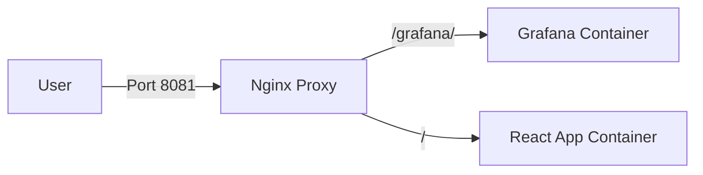

# Grafana Embedding Test Project

This project demonstrates how to embed a Grafana dashboard into a React application using an Nginx reverse proxy to handle CORS and authentication headers.

## Architecture



## Prerequisites

- Docker & Docker Compose
- Node.js & npm

## Setup & Running

1.  **Start the Backend Services (Grafana + Nginx)**
    Navigate to the `grafana-proxy-docker` directory and start the containers:
    ```bash
    cd grafana-proxy-docker
    docker-compose up -d --build
    ```
    This will start:
    - Grafana on port 3000 (internal)
    - Nginx on port 8081 (exposed to host)
    - React App build (served by Nginx, optional if running dev server)

2.  **Start the Frontend (Development)**
    Navigate to the `frontend` directory and start the Vite dev server:
    ```bash
    cd frontend
    npm run dev
    ```
    Access the application at `http://localhost:5173`.

## Features

- **Automated Provisioning**: Grafana dashboards are automatically provisioned from `grafana-proxy-docker/dashboard.json`.
- **Embedding**: Grafana is configured to allow embedding (`GF_SECURITY_ALLOW_EMBEDDING=true`).
- **Anonymous Auth**: Anonymous access is enabled for easy embedding (`GF_AUTH_ANONYMOUS_ENABLED=true`).
- **Custom Dashboard**: Includes a "Test Panel" and a "Weather Temperature" chart.

## Troubleshooting

- **Dashboard not loading?**
    - Ensure Docker containers are running: `docker ps`
    - Check Grafana logs: `docker logs grafana-proxy-docker-grafana-1`
    - Ensure you are accessing the frontend via `localhost` to match the Nginx proxy settings.


## Generate Self Signed Certificate
```bash
mkdir -p nginx/certs && openssl req -x509 -nodes -days 365 -newkey rsa:2048 -keyout nginx/certs/nginx.key -out nginx/certs/nginx.crt -subj "/CN=hotai1806.servegame.com"
```
